# Mindful CMS Frontend

This is the frontend application for the Mindful CMS, built with React, TypeScript, and Vite.

## Project Overview
Mindful CMS is a modern, responsive content management system frontend designed to provide a seamless blogging experience. It features a robust dashboard for content creators, intuitive blog management tools, and a clean, engaging reader interface. The application is built with performance and user experience in mind, utilizing modern web technologies to ensure speed and accessibility.

## Technology Stack
The project leverages a modern tech stack to ensure scalability, maintainability, and performance:

-   **Core Framework**: [React 18](https://react.dev/)
-   **Language**: [TypeScript](https://www.typescriptlang.org/)
-   **Build Tool**: [Vite](https://vitejs.dev/)
-   **Routing**: [React Router DOM 6](https://reactrouter.com/)
-   **Styling**: [Tailwind CSS](https://tailwindcss.com/), PostCSS, Autoprefixer
-   **Icons**: [Lucide React](https://lucide.dev/)
-   **Linting & Code Quality**: ESLint

## Project Structure
A quick look at the top-level files and directories you'll see in the project:

```text
src/
├── api/          # API integration and service calls
├── components/   # Reusable UI components
├── context/      # React Context for global state management
├── layouts/      # Page layout components (e.g., Dashboard, Public)
├── pages/        # Application page views
├── routes/       # Route definitions and configuration
└── styles/       # Global styles and Tailwind configuration
```

## Getting Started

Follow these steps to set up the project locally.

### Prerequisites

-   [Node.js](https://nodejs.org/) (Version 16 or higher recommended)
-   npm (comes with Node.js)

### Installation

1.  **Clone the repository**

    ```bash
    git clone https://github.com/SabonaWaktole/blog-post-saas-frontend.git
    cd blog-post-frontend
    ```

2.  **Install dependencies**

    ```bash
    npm install
    ```

3.  **Environment Setup**

    Create a `.env` file in the root directory and configure your API URL:

    ```bash
    VITE_API_BASE_URL=http://localhost:3000/api/v1
    ```

4.  **Run the development server**

    ```bash
    npm run dev
    ```

    Open [http://localhost:5173](http://localhost:5173) with your browser to see the result.

## Available Scripts

In the project directory, you can run:

-   `npm run dev`: Runs the app in the development mode.
-   `npm run build`: Builds the app for production to the `dist` folder.
-   `npm run lint`: Runs ESLint to check for code quality issues.
-   `npm run preview`: Locally preview the production build.

## Contributing

Contributions are welcome! Please feel free to submit a Pull Request.

## License

This project is licensed under the MIT License.

## Application Screenshots

Below is a walkthrough of the application's key pages and features.

### 1. Landing Page / Home
Overview of the blog platform, showcasing the value proposition and entry points.
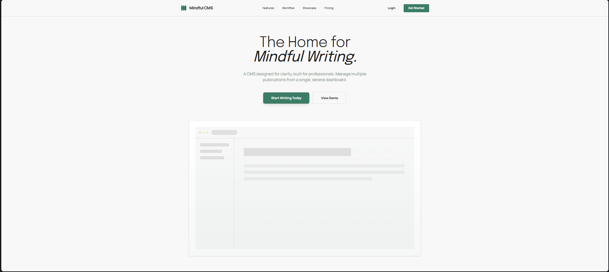

### 2. Blog List / Feed
Display of the latest blog posts available for reading.
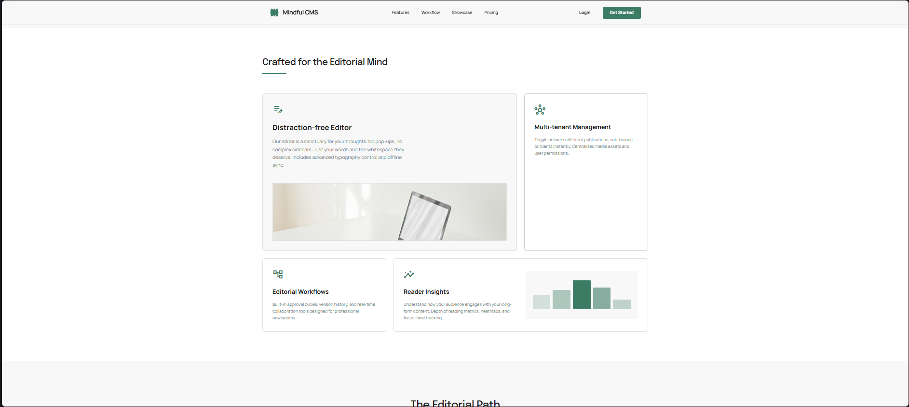

### 3. Article Detail
Reading view for a single blog post, showing content, author, and engagement options.
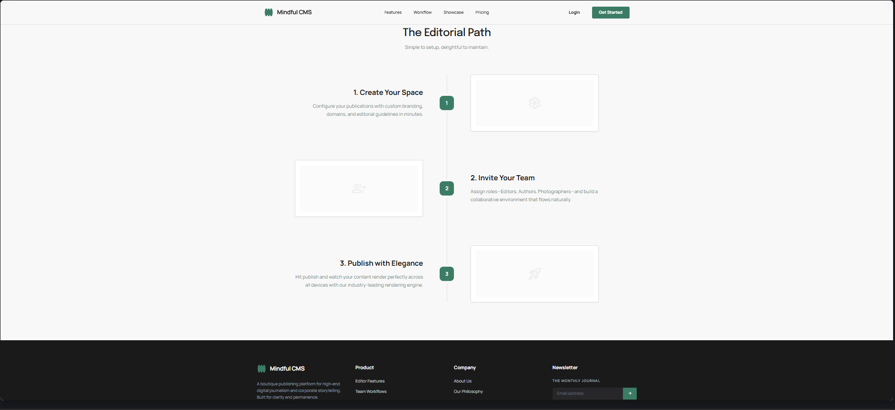

### 4. Author Profile
Public profile page of a blog author, listing their bio and posts.
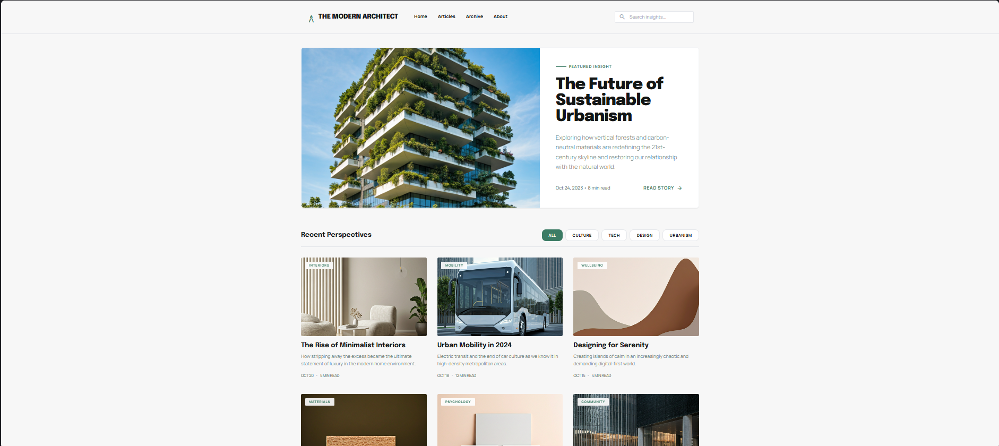

### 5. Login
User authentication screen for accessing the dashboard.
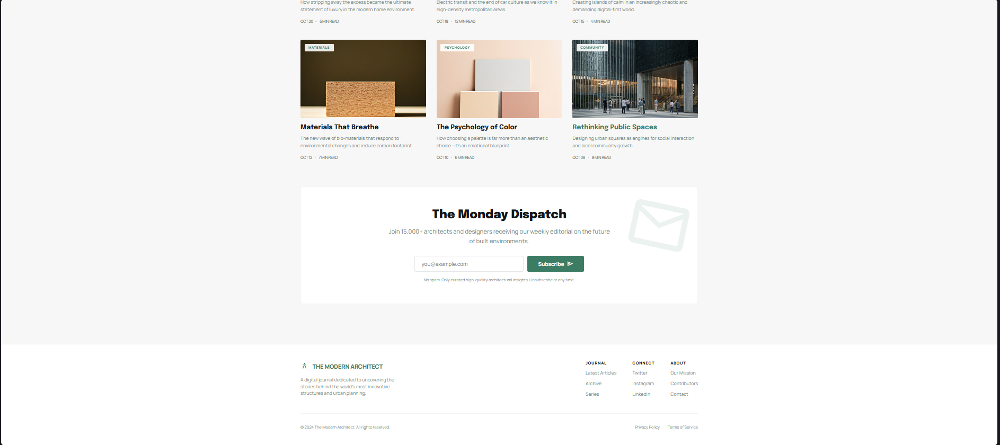

### 6. Register
New user sign-up screen to create an account.


### 7. Dashboard Overview
The main dashboard view after login, showing key metrics and statistics.
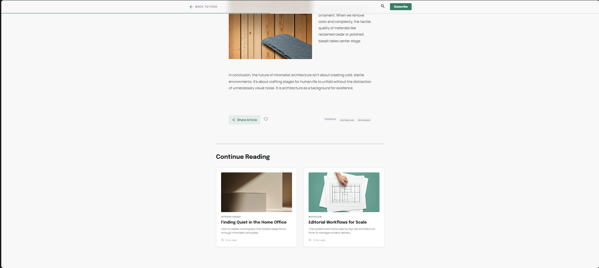

### 8. Content Management
Interface for listing, searching, and managing blog posts.
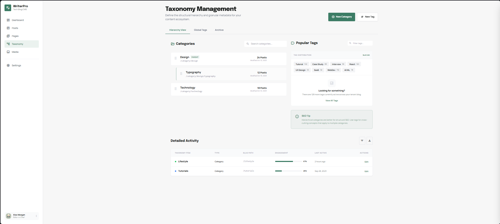

### 9. Blog Management
Screen for managing multiple blogs or tenants within the system.
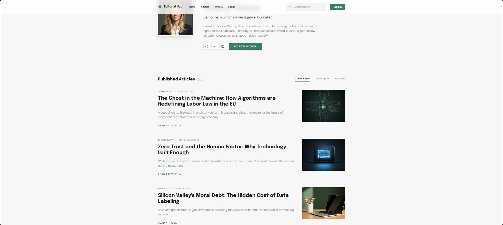

### 10. Taxonomy Management
Tools for managing categories and tags to organize content.
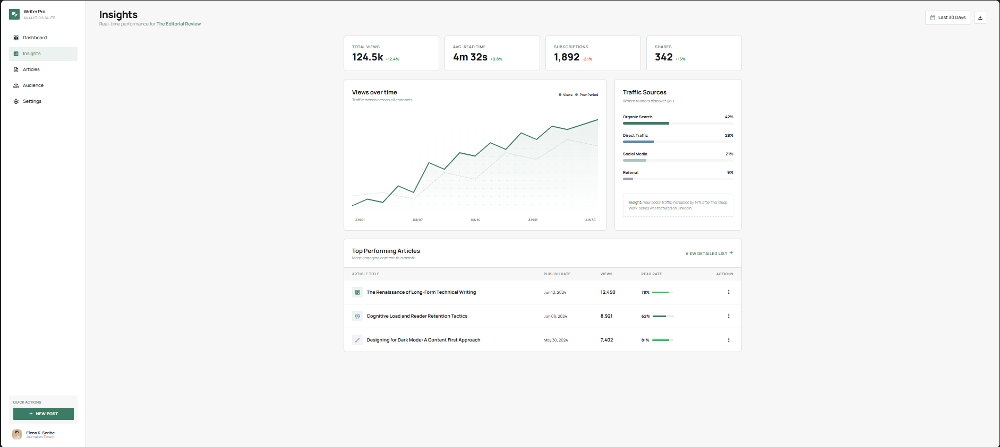

### 11. Analytics
Detailed performance analytics and insights for the blogs.


### 12. Editor (New Post)
The rich text editor interface for creating a new blog post.
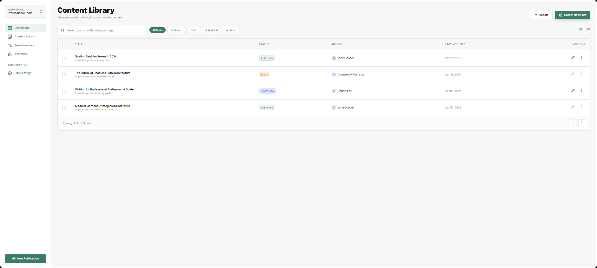

### 13. Editor (Edit Post)
The editor interface pre-loaded with content for modifying an existing post.
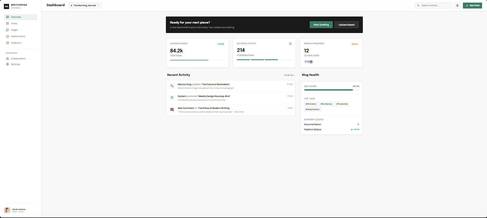

### 14. Additional UI / Settings
Miscellaneous or secondary UI elements (e.g., Settings, Modals, or Previews).

